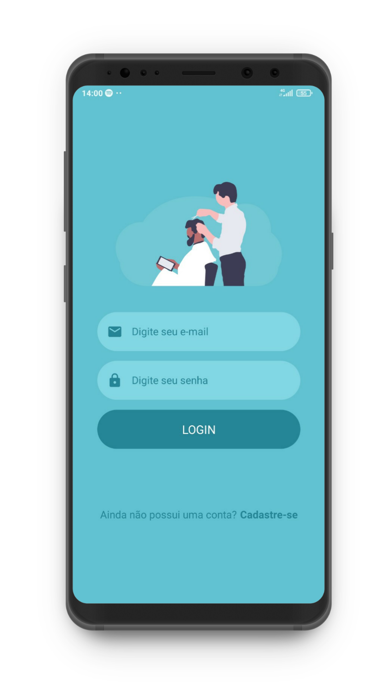

# BarberShop Mobile - React Native

Application to find barbershop, services and make appointments, simply and safely.

  

## Need

* Android SDK
* NodeJS
* React Native CLI
* Yarn

## Install

  1. Dependences
  
    yarn install
    
  2. Install APP
  
    react-native run-android
    
  or
    
    react-native run-ios

  3. Start
  
    npm start
    
   or
    
    expo start
